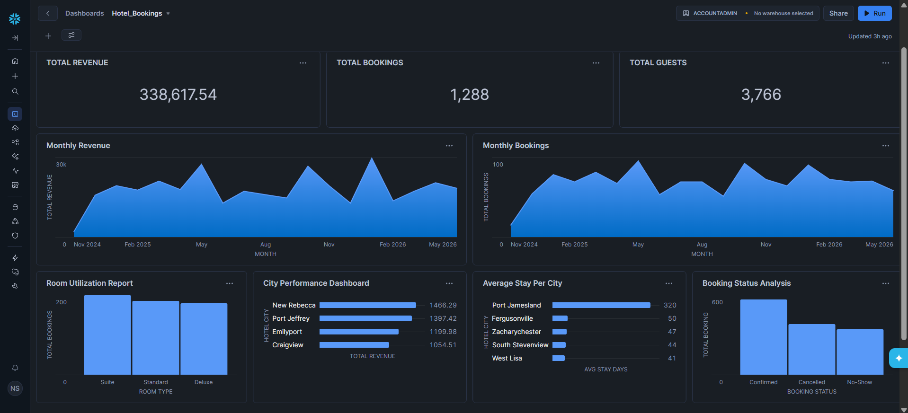
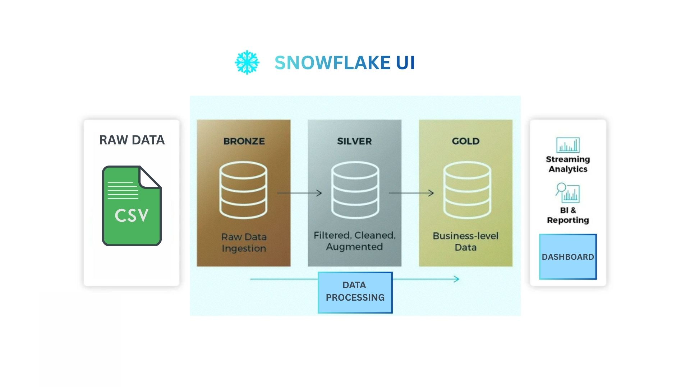

# 🏨 Hotel Booking Analysis in Snowflake

## 📌 Project Overview

This project demonstrates an end-to-end data analytics pipeline built using Medallion Architecture in Snowflake.

The goal is to analyze hotel booking data to uncover insights related to:
- Revenue trends
- Cancellation behavior
- Seasonal demand
- Operational performance

The solution follows a structured data engineering approach:

Bronze → Silver → Gold

## 🖼 Screenshots

## 🏗 Architecture

🔹 Bronze Layer (Raw Data)

- Raw CSV ingested into Snowflake
- No transformations applied
- Maintains original schema
- Used for traceability & audit
-----------------------------
🔹 Silver Layer (Cleaned & Standardized)

Applied transformations:
- Trimmed string columns
- Standardized names
- Converted date columns
- Handled null values
-----------------------------
🔹 Gold Layer (Business Aggregations)

- Business-ready views created for reporting.

## 📊 Key Business KPIs Built

💰 Revenue Analysis
- Total Revenue
- Monthly Revenue Trend
- Revenue by City

❌ Cancellation Rate

📈 Bookings Analysis
- Total Bookings
- Bookings by Room Type
- Booking analysis by Status
- Average number of days stayed per City

## 🧠 Business Insights Derived

- Peak booking months identified
- Higher cancellation rates observed for long lead times
- City hotels showed higher ADR than resort hotels
- Repeat guests contributed significantly to stable revenue

## 🛠 Tools & Technologies

- Snowflake
- SQL
- Medallion Architecture
- Data Modeling
- Aggregation & KPI Design

## 📁 Project Structure
/sql
    bronze_layer.sql
    silver_layer.sql
    gold_layer.sql
/dataset
    hotel_bookings_raw.csv
/images
    dashboard_screenshots.png
README.md

## 🚀 Learning Outcomes

- Implemented Medallion Architecture in Snowflake
- Built data pipelines using layered modeling
- Practiced advanced SQL transformations
- Designed star schema
- Created business KPIs from raw data
- Improved analytical storytelling

## 📌 Future Enhancements

- Automate pipeline using Snowflake Tasks
- Add Streams for incremental loading
- Integrate BI tool (Power BI / Tableau)
- Implement performance optimization using clustering